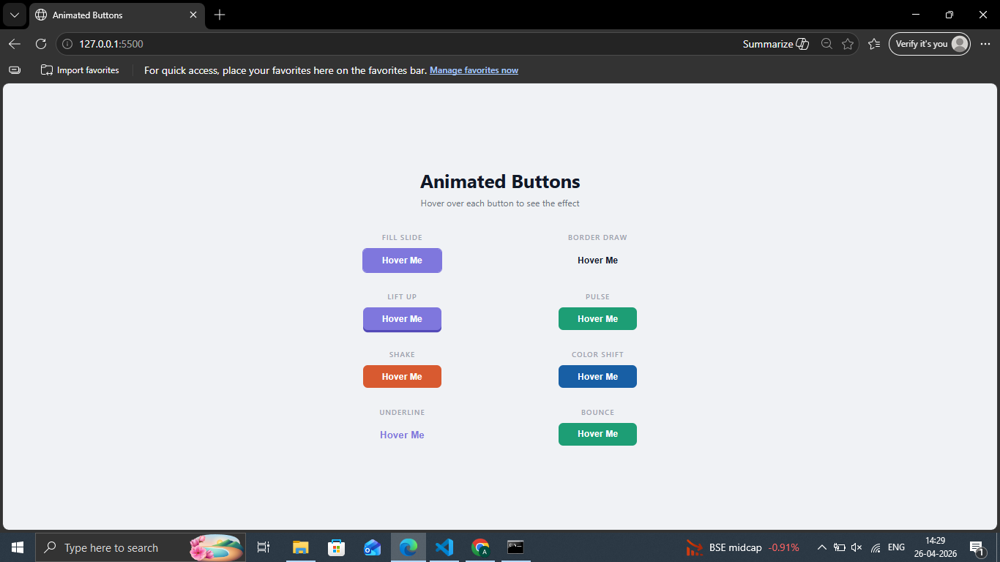

# Day 06 — Animated Button Set

A collection of 8 CSS animated buttons with different hover effects.

## Preview

## Buttons Included
- Fill Slide — background slides in from left
- Border Draw — border draws on hover
- Lift Up — button lifts with 3D shadow
- Pulse — pulsing scale animation
- Shake — shakes left and right
- Color Shift — smoothly changes color
- Underline — underline grows from center
- Bounce — bounces up on hover

## Tech Stack
- HTML5
- CSS3 (animations, keyframes, pseudo-elements, transitions)

## What I Learned
- CSS keyframe animations
- Using ::before and ::after pseudo-elements
- Combining transform and transition for smooth effects
- overflow hidden trick for slide effects

## Part of
[30 Days 30 Projects](https://github.com/anmisha-dash/30-days-30-projects) challenge